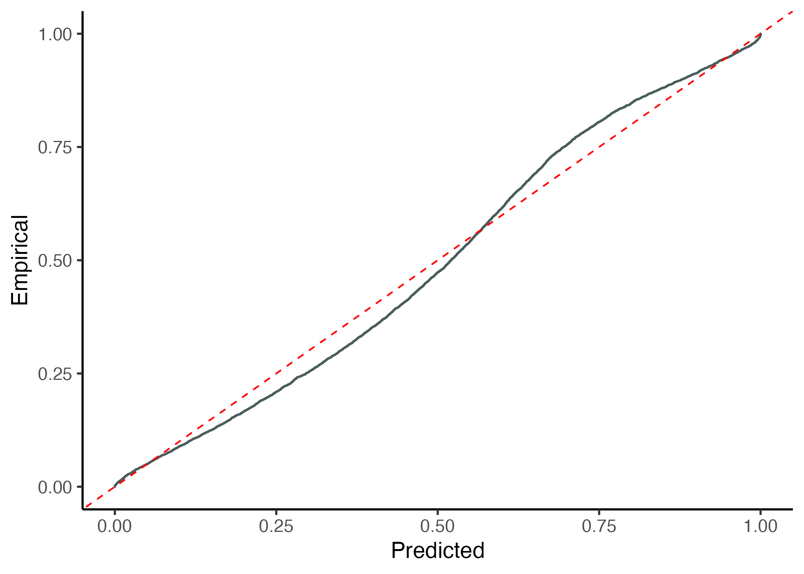

<!-- README.md is generated from README.Rmd. Please edit that file -->

```{r, include = FALSE}
knitr::opts_chunk$set(
  collapse = TRUE,
  comment = "#>",
  fig.path = "man/figures/README-",
  out.width = "80%",
  fig.align = "center"
  
)
```

# recalibratiNN

<!-- badges: start -->

<!-- badges: end -->

This package aims to provide post processing methods to recalibrate fitted Gaussian models.

{style="image-align: center;" width="200"}

## Installation

You can install the development version of recalibratiNN from [GitHub](https://github.com/) with:

``` {r}
# install.packages("devtools")
devtools::install_github("cmusso86/recalibratiNN")

library(recalibratiNN)
```

Alternately, one can use the `pacman` package to both install and download. 

```{r}
if(!require(pacman)) install.packages("pacman")
pacman::p_load_current_gh("cmusso86/recalibratiNN")
```


## Example

### Diagnosing miscalibration

#### Global Calibration

This is a basic example which shows you how to solve a common problem of miscalibration. 
To do so, we created an heterocedastic model and fitted with a simple linear regression.   

```{r example, warning=FALSE}
library(recalibratiNN)

## basic example code


set.seed(42)
n <- 10000
split <- 0.8

# Auxiliary functions
mu <- function(x1){
10 + 5*x1^2
}

sigma_v <- function(x1){
30*x1
}

# generating heterocedastic data (true model)

x <- runif(n, 1, 10)
y <- rnorm(n, mu(x), sigma_v(x))


# slipting data 
x_train <- x[1:(n*split)]
y_train <- y[1:(n*split)]

x_cal <- x[(n*split+1):n]
y_cal <- y[(n*split+1):n]

# fitting a simple linear model
model <- lm(y_train ~ x_train)
```

The points, the true mean and the regression can be observed in the graph below.


using the fuction PIT_values() to obtain pit-values for the fitted model for a calibration set.
```{r}
y_hat <- predict(model, newdata=data.frame(x_train=x_cal))

MSE_cal <- mean((y_hat - y_cal)^2)

pit <- PIT_global(ycal=y_cal, yhat=y_hat, mse=MSE_cal)

head(pit)
```

Then, one can proceed with visualizing this the histogram and testing if it fits a uniform distribution.

```{r echo=F, message=FALSE, warning=FALSE}
library(ggplot2)
ggP <- gg_PIT_global(pit)
ggsave(plot=ggP, "man/figures/ggP.png")
```


```{r eval=F}
gg_PIT_global(pit)
```

```{r echo=F}

```

In this case, since we are fiting an lm() to an heterocedastic model, the histogram seems shifted indication a misscalibration. In the image we also present the p_value from the hispothesis testing of Kolmogorov-Smirnov test, performed with the `ks.test()` function from `stats` package.

One can also want to visualize the miscalibration as QQ-plot-like graph, showing the cumulative predictive distribution in the x-axis versus the empirical cumulative distribution. 

```{r eval=F}
gg_QQ_global(pit, y_cal, y_hat, MSE_cal)
```

```{r, echo=F, message=FALSE, warning=FALSE}
ggQ <- gg_QQ_global(pit, y_cal, y_hat, MSE_cal)
ggsave(plot=ggQ, "man/figures/ggQ.png")

```

#### Local Calibration

```{r echo=F, message=FALSE, warning=FALSE}

pit_local <- PIT_local(xcal = x_cal, ycal=y_cal, yhat=y_hat, mse=MSE_cal)


g1pl <- gg_PIT_local(pit_local)
g2pl <- gg_PIT_local(pit_local, facet=T)

ggsave(plot=g1pl, "man/figures/plot1PL.png")
ggsave(plot=g2pl, "man/figures/plot2PL.png")


```

```{r  eval=F}
pit_local <- PIT_local(xcal = x_cal, ycal=y_cal, yhat=y_hat, mse=MSE_cal)

gg_PIT_local(pit_local)

```

```{r echo=F}
knitr::include_graphics("man/figures/plot1PL.png")
```

Or you can facet the graph:

```{r eval=F}
gg_PIT_local(pit_local, facet=T)
```

```{r echo=F}
knitr::include_graphics("man/figures/plot2PL.png")
```

Alternatively you can observe the miscalibration in the QQ-graph.

```{r eval=F}
gg_QQ_local(pit_local)
gg_QQ_local(pit_local, facet=T)

```

```{r echo=F, message=FALSE, warning=FALSE}

g1ql <- gg_QQ_local(pit_local)
g2ql <- gg_QQ_local(pit_local, facet=T)

ggsave(plot=g1ql, "man/figures/plotQL1.png")
ggsave(plot=g2ql, "man/figures/plotQL2.png")
```

```{r echo=F}
knitr::include_graphics("man/figures/plotQL1.png")
knitr::include_graphics("man/figures/plotQL2.png")
```


