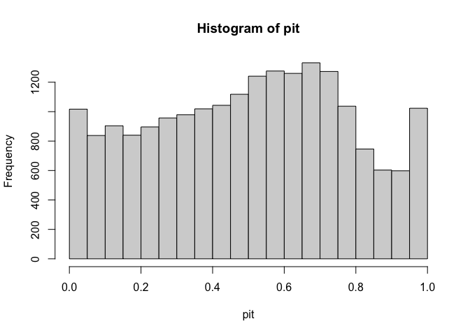

<!-- README.md is generated from README.Rmd. Please edit that file -->

# recalibratiNN

<!-- badges: start -->
<!-- badges: end -->

This package aims to provide post processing methods to recalibrate
fited models.

library(devtools)

## Installation

You can install the development version of recalibratiNN from
[GitHub](https://github.com/) with:

``` r
# install.packages("devtools")
devtools::install_github("cmusso86/recalibratiNN")
```

## Example

This is a basic example which shows you how to solve a common problem
using the fuction PIT_values() to obtain pit-values for the fitted model
for a calibration set.

``` r
library(recalibratiNN)
## basic example code

n = 100000

mu <- function(x1){
 10 + 5*x1^2
 }

 sigma_v <- function(x1){
 30*x1
 }
 
x <- runif(n, 2, 20)
y <- rnorm(n, mu(x), sigma_v(x))

x_test <- x[1:80000]
y_test <- y[1:80000]

x_cal <- x[80001:100000]
y_cal <- y[80001:100000]

mod <- lm(y_test ~ x_test)

cdf <- CDF_model_lm(x_cal=x_cal, model=mod)
pit <- PIT_values_lm( y_cal, cdf)
head(pit)
#> [1] 0.2153658 0.5336155 0.9960953 0.2692699 0.8388668 0.3277079
```

Then, one can proceed with visualizin this the histogram and testing if
it fits a uniform distribution.

``` r
hist(pit)
```



In this case, since we are fiting an lm(0 to an heterocedastic model,
the histogram seems shifted indication a misscalibration. You’ll still
need to render `README.Rmd` regularly, to keep `README.md` up-to-date.
`devtools::build_readme()` is handy for this.

You can also test if these values fit a uniform distribution.

    #> 
    #>  Asymptotic two-sample Kolmogorov-Smirnov test
    #> 
    #> data:  pit and runif(10000, -1, 1)
    #> D = 0.5023, p-value < 2.2e-16
    #> alternative hypothesis: two-sided

in this case we see the distribution doest seem to fit an uniform
distribution.
