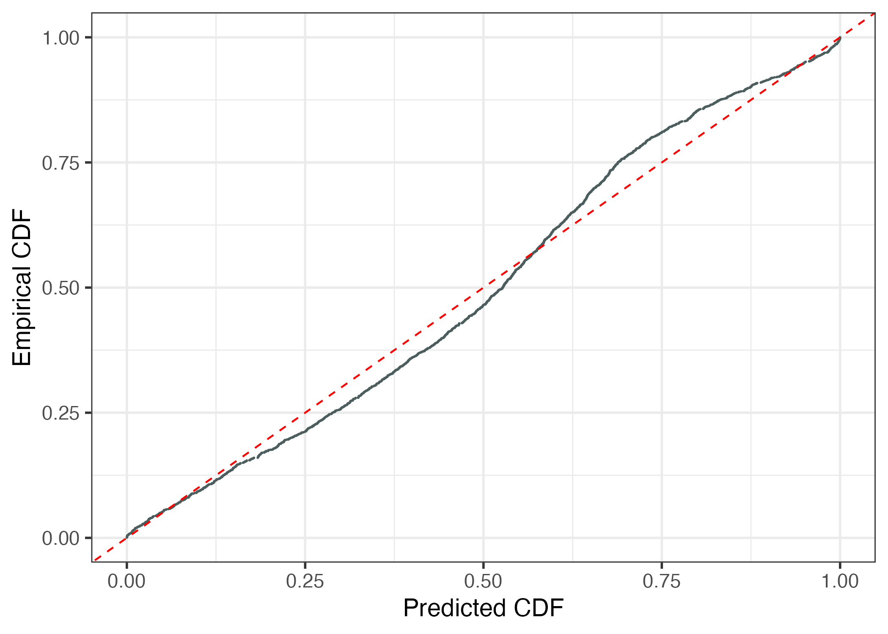
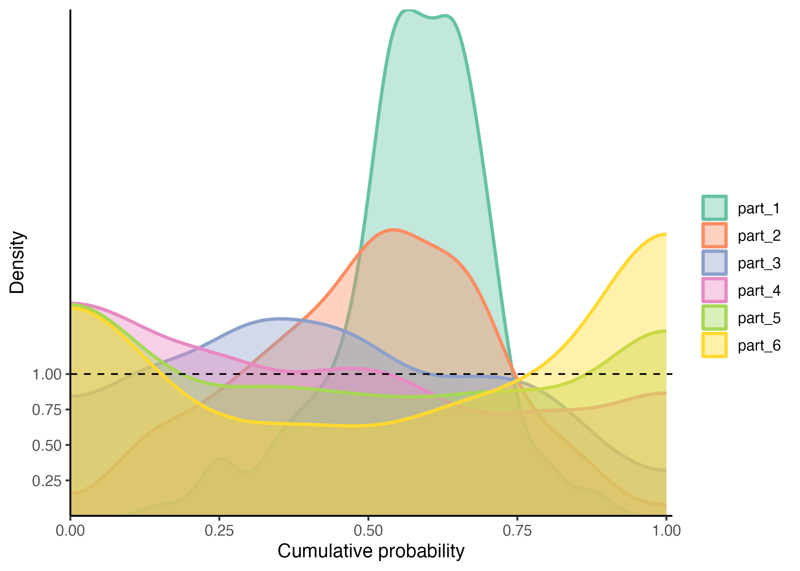
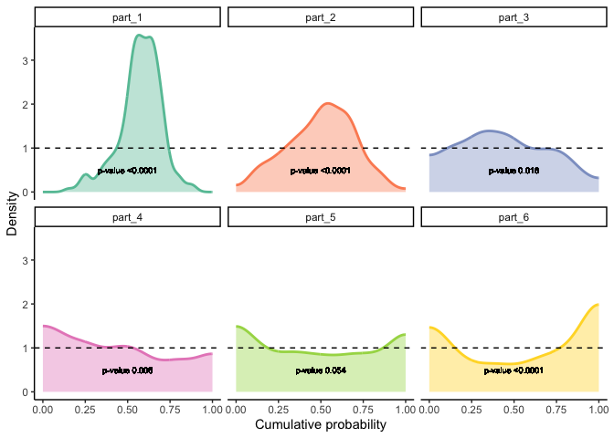
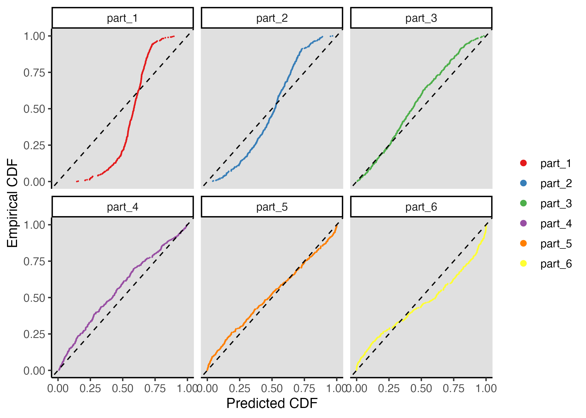
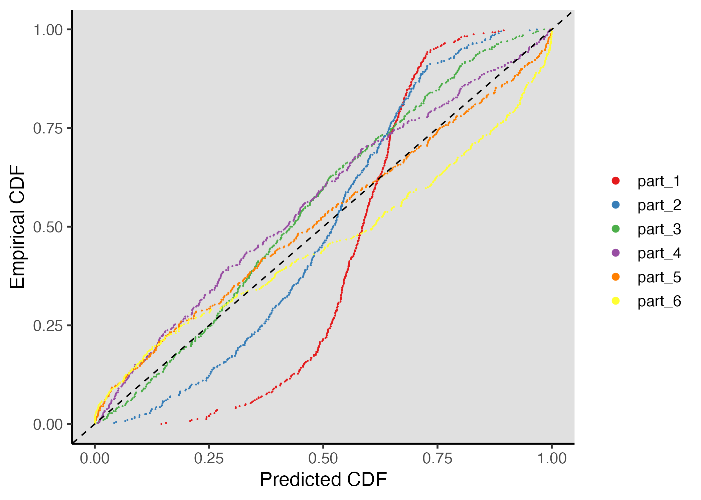

<!-- README.md is generated from README.Rmd. Please edit that file -->

# recalibratiNN

<!-- badges: start -->
<!-- badges: end -->

This package aims to provide post processing methods to recalibrate
fited models.


## Installation

You can install the development version of recalibratiNN from
[GitHub](https://github.com/) with:

``` r
# install.packages("devtools")
devtools::install_github("cmusso86/recalibratiNN")
```

## Example

### Diagnosing miscalibration

#### Global Calibration

This is a basic example which shows you how to solve a common problem
using the fuction PIT_values() to obtain pit-values for the fitted model
for a calibration set.

``` r
library(recalibratiNN)
## basic example code
set.seed(42)
n <- 10000
split <- 0.8

# generating heterocedastic data
mu <- function(x1){
10 + 5*x1^2
}

sigma_v <- function(x1){
30*x1
}

# slipting data 

x <- runif(n, 1, 10)
y <- rnorm(n, mu(x), sigma_v(x))

x_train <- x[1:(n*split)]
y_train <- y[1:(n*split)]

x_cal <- x[(n*split+1):n]
y_cal <- y[(n*split+1):n]

# fitting a simple linear model
model <- lm(y_train ~ x_train)

y_hat <- predict(model, newdata=data.frame(x_train=x_cal))

MSE_cal <- mean((y_hat - y_cal)^2)

pit <- PIT_global(ycal=y_cal, yhat=y_hat, mse=MSE_cal)

head(pit)
#> [1] 0.04551257 0.42522358 0.81439164 0.69119416 0.44043239 0.99770918
```

Then, one can proceed with visualizing this the histogram and testing if
it fits a uniform distribution.

``` r
gg_PIT_global(pit)
```


In this case, since we are fiting an lm() to an heterocedastic model,
the histogram seems shifted indication a misscalibration. In the image
we also present the p_value from the hispothesis testing of
Kolmogorov-Smirnov test, performed with the `ks.test()` function from
`stats` package.

One can also want to visualize the miscalibration as QQ-plot-like graph,
showing the cumulative predictive distribution in the x-axis versus the
empirical cumulative distribution.

``` r
gg_QQ_global(pit, y_cal, y_hat, MSE_cal)
```



#### Local Calibration

``` r
pit_local <- PIT_local(xcal = x_cal, ycal=y_cal, yhat=y_hat, mse=MSE_cal)

gg_PIT_local(pit_local)
```



Or you can facet the graph:





Alternatively you can observe the miscalibration in the QQ-graph.

``` r
gg_QQ_local(pit_local)
gg_QQ_local(pit_local, facet=T)
```


