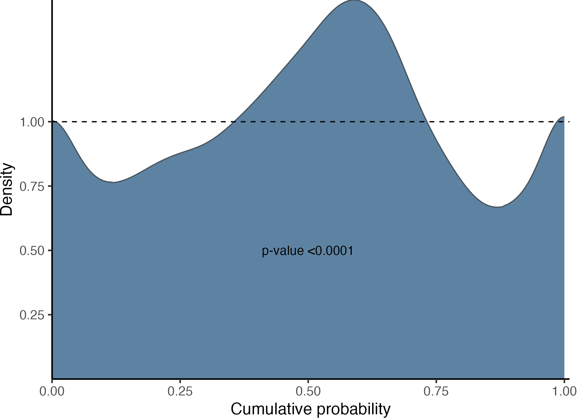
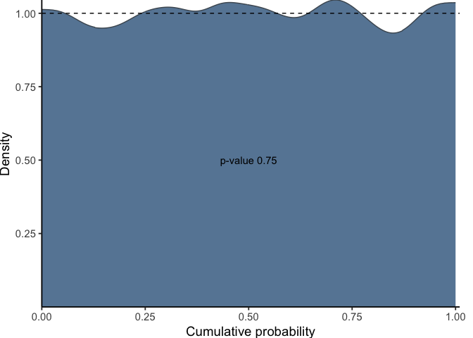
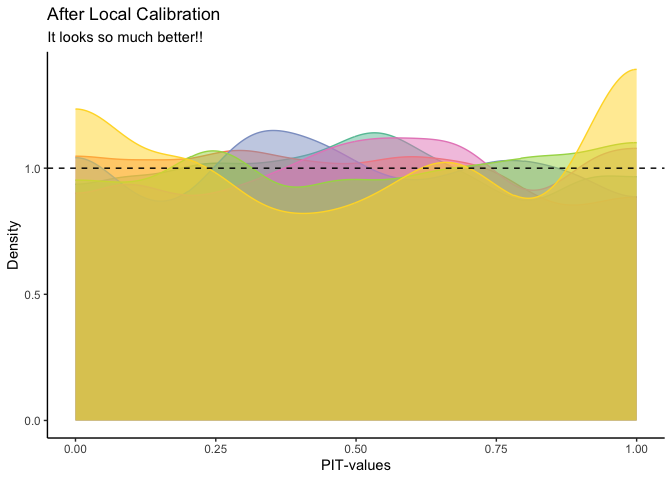

<!-- README.md is generated from README.Rmd. Please edit that file -->

# recalibratiNN


<!-- badges: start -->

[](https://CRAN.R-project.org/package=recalibratiNN)
[](https://www.r-pkg.org/pkg/recalibratiNN)
<!-- badges: end -->

This package provides a post processing method to recalibrate fitted
Gaussian models. The method is based on the work of Torres R, Nott DJ,
Sisson SA, et al. (2024). [“Model-Free Local Recalibration of Neural
Networks”](https://doi.org/10.48550/arXiv.2403.05756).

## Installation

### From CRAN

You can install the current stable version of recalibratiNN with:

``` r
install.packages("recalibratiNN")

library(recalibratiNN)
```

### From GitHub

Otherwise, you can install the development version from GitHub with.
Presently, the version in GitHub is the most updated, particularly
regarding the documentation.

``` r
# install.packages("devtools")
devtools::install_github("cmusso86/recalibratiNN")

library(recalibratiNN)
```

Alternately, one can use the `pacman` package to both install and
download.

``` r
if(!require(pacman)) install.packages("pacman")
pacman::p_load_current_gh("cmusso86/recalibratiNN")
```

## Understanding calibration/miscalibration

This example illustrates a common issue of miscalibration. To
demonstrate this, we created a heteroscedastic model and fitted it using
simple linear regression for visualization purposes.

``` r

## basic artificial model example


set.seed(42)
n <- 42000
split <- 0.8

# Auxiliary functions
mu <- function(x1){
10 + 5*x1^2
}

sigma_v <- function(x1){
30*x1
}

# generating heterocedastic data (true model)

x <- runif(n, 1, 10)
y <- rnorm(n,mu(x), sigma_v(x))


# slipting data 
x_train <- x[1:(n*split)]
y_train <- y[1:(n*split)]

x_cal <- x[(n*split+1):n]
y_cal <- y[(n*split+1):n]

# fitting a simple linear model
model <- lm(y_train ~ x_train)
```

In the graph below, you can observe the true mean, the data points, and
the regression line. The linear model, represented by a dashed black
line, consistently underestimates the mean for both small and large
values of $x$. Additionally, it overestimates the variance at lower
values of $x$, as indicated by all points falling within the confidence
interval (CI). Conversely, at higher values of $x$, the model
underestimates the true variance. These discrepancies highlight the
model’s inability to accurately quantify uncertainty, showcasing it as
an example of a miscalibrated model.

``` r
pacman::p_load(tidyverse)
pacman::p_load_gh("AllanCameron/geomtextpath")

# use predict to get the confidence intervals
data_predict <- predict(model, 
                        newdata=data.frame(x_train=x_cal), 
                        interval = "prediction") %>% 
  as_tibble() %>% 
  dplyr::mutate(x_cal=x_cal, 
                y_cal=y_cal,
          CI=ifelse(y_cal<=upr&y_cal>=lwr, "in", "out")) 

data_predict %>% 
  ggplot(aes(x_cal))+
  geom_point(mapping=aes(x_cal, y_cal, color=CI), alpha=0.6)+
  geom_labelline(aes( y=mu(x_cal), label="True Mean" ), 
                 size=1.8, hjust=-0.01, linewidth=0.7, color="red" )+
  geom_smooth(aes( y=y_cal ), color="black",se=F,
                   method="lm", formula=y~x,linetype="dashed" )+
  scale_color_manual("IC 95%", values=c("#00822e", "#2f1d86"))+
  theme_classic()
   
```

<div class="figure" style="text-align: center">


<p class="caption">
Model coverage, true mean (red) and estimated mean (black dashed line).
</p>

</div>

## Using the recalibratiNN package

In real-world scenarios, especially with higher-dimensional models,
evaluating miscalibration as described above is not feasible . A widely
used method for assessing global calibration in such cases is through
the analysis of Probability Integral Transform (PIT) values. PIT values
quantify the estimated cumulative probability of the observed values
within the predicted distribution. This approach involves generating a
histogram or density plot of the cumulative distribution functions
predicted by the model for each observation. A well-specified model will
yield a distribution that closely resembles a Uniform distribution.

### Observing global calibration/miscalibration

To obtain PIT values for the fitted model using a calibration set, we
first use the `PIT_values()` function. This requires some preliminary
calculations that will be used as arguments: predicted values of the
fitted model for new observations (using predict); the Mean Squared
Errors for the validation set, which in this context is referred to as
the ‘calibration set’.

``` r
library(recalibratiNN)

# predictions for the calibration set
y_hat <- predict(model, 
                 data.frame(x_train = x_cal))

# MSE from calibration set
MSE_cal <- mean((y_hat - y_cal)^2) # a little different from MSE from training set

# USE tha recalibratiNN::PIT_local() to calculate the pit-values.

pit <- PIT_global(ycal=y_cal, 
                  yhat=y_hat, 
                  mse=MSE_cal)

head(pit)
#> [1] 0.04664277 0.32280556 0.58780953 0.94944249 0.67383645 0.15426510
```

Following these steps, you can then visualize the histogram and assess
its fit to a uniform distribution using the `gg_PIT_global()` function.
For additional customization options, refer to the function’s
documentation.

``` r
gg_PIT_global(pit)
```



In this instance, as we are fitting a linear model (`lm()`) to a
heteroscedastic model it is expected that the histogram indicated
miscalibration. Additionally, the image includes the p-value from the
hypothesis testing using the Kolmogorov-Smirnov test, conducted with the
`ks.test()` function from the stats package.

It is also to use other visualization function of the package with the
`gg_CD_global`. This graph shows the cumulative predictive distribution
in the x-axis versus the empirical cumulative distribution and require
four parameters.

``` r
gg_CD_global(pit,
             y_cal, 
             y_hat, 
             MSE_cal)
```


### Local Calibration

However, relying solely on global calibration can be deceptive. A model
may appear well-calibrated on a global scale, yet exhibit significant
issues on a local level. For example, the model in question demonstrates
a coverage close to 95%, aligning with the expected 95% confidence
interval. Nonetheless, a closer inspection reveals that the distribution
of erros is not consistent. In certain regions, the model consistently
exhibits greater inaccuracies, indicating systematic errors.

The observed disparities are evident in the graphs below. To analyze
these, we first compute local PIT values using the `PIT_local()`
function. This function divides the covariate space into ‘n’ clusters,
with a default of 6, using a k-means algorithm. It then identifies
neighbors around the centroids of each cluster.

Observing this graph, we notice the model is uncalibrated in different
ways thoughout the covariates space.

``` r
# calculating local PIT 
pit_local <- PIT_local(xcal = x_cal, 
                       ycal= y_cal, 
                       yhat = y_hat, 
                       mse = MSE_cal)

gg_PIT_local(pit_local)
```


In the initial segment, the model overestimates the variance while
underestimating the mean. In contrast, the middle region shows better
calibration, with the model’s predictions aligning more closely with
observed values. Towards the end, however, it underestimates the
variance. These distinct behaviors in different partitions of the data
clearly suggest that the model would benefit from local calibration, as
each section exhibits unique calibration needs.

Alternatively you can observe the local miscalibration in the CD-graph.

``` r
gg_CD_local(pit_local, mse = MSE_cal)
gg_CD_local(pit_local, mse = MSE_cal, facet = T)
```


### Recalibration

This Quantile recalibration method produces Monte Carlo samples from a
predictive distribution, which is unknown yet expected to be more
calibrated. This process also yields recalibrated estimates of the
weighted mean and variance.

The `recalibrate()` function implements the method described by Torres
et al. (2023), drawing inspiration from Approximate Bayesian
Computation. This method can be applied globally or locally. In our
heteroscedastic example, local calibration shows superior performance.
It employs a KNN algorithm to identify the nearest neighbors from the
calibration set to the new or test set provided.

To execute recalibration, it’s essential to supply the global PIT
values, irrespective of the recalibration type, along with the Mean
Squared Error of the calibration set. The neighbor search can be
conducted at the covariate level, at any intermediate layer (as in a
Neural Network), or even at the output layer.

The function calculates the PIT values and employs the Inverse Transform
Theorem to generate recalibrated samples. By default, the size of the
vicinity is set at 20% of the calibration set, but this can be
customized using the p_neighbours argument.

``` r
# new data 
x_new <- runif(n/5, 1, 10)
y_hat_new <- predict(model,
                     data.frame(
                       x_train=x_new)
                     )

# recalibration
rec <- recalibrate(yhat_new = y_hat_new,
                   space_new = x_new,
                   space_cal = x_cal,
                   pit_values = pit,
                   mse = MSE_cal,
                   type = "local",
                   p_neighbours=0.2)
```

Now, we possess a list of new parameters and Monte Carlo samples from a
predictive distribution that is expected to be calibrated. Although the
exact form of this new distribution is unknown, we can estimate its
parameters.

``` r
new_yhat <- rec$y_hat_calibrated # calibrated means
```

# Bonus section: checking if it worked

To look for more examples of successful application of this method in
the calibration, please refer to Torres et. al (2023).

For this exercise, we’ll deviate slightly from standard practices and
assess the calibration on our test set, referred to here as the ‘new
set.’ This deviation is permissible in our artificial example because we
know the true model/process that generated the data. Consequently, we
can compute the empirical PIT values to determine if the predictions are
now better calibrated. It’s important to note that this is purely an
educational exercise; in real-world scenarios, such an approach might
not be feasible. Additionally, this specific evaluation method is not
implemented in the package and is presented here solely to illustrate
its effectiveness in this scenario.

Note that since we dont know the real distribution, we can only
calculate the empirical PIT-values, and not the ones provided ny the
Inverse Transform Theorem.

``` r
# what youd be the real observations in this example
y_new_real <- rnorm(n/5, 
                    mu(x_new), 
                    sigma_v(x_new))

# retrieving the weighted samples
y_hat_recalib <- rec$y_samples_calibrated_wt

# empirical p-value distribution
pit_new <- purrr::map_dbl(
  1:length(y_new_real), ~{
    mean(y_hat_recalib[.,] <=y_new_real[.] )
  })

gg_PIT_global(pit_new)
```



We see now that the pit-values are approximately uniform, at least
globally. Bellow, we also see that the local calibration is improved.

``` r
n_neighbours <- 800
clusters <- 6

# calculating centroids
cluster_means_cal <- stats::kmeans(x_new, clusters)$centers
  cluster_means_cal <- cluster_means_cal[order(cluster_means_cal[,1]),]

  
# finding neighbours
knn_cal <- RANN::nn2(x_new, cluster_means_cal,  k=n_neighbours)$nn.idx


# geting corresponding ys (real and estimated)
y_new_local <- purrr::map(1:nrow(knn_cal),  ~y_new_real[knn_cal[.,]])
y_hat_local <-purrr::map(1:nrow(knn_cal),  ~y_hat_recalib[knn_cal[.,],])


# calculate pit_local

pits <- matrix(NA, nrow=6, ncol=800)
for (i in 1:clusters) {
    pits[i,] <- purrr::map_dbl(1:length(y_new_local[[1]]), ~{
      mean(y_hat_local[[i]][.,] <= y_new_local[[i]][.])
    })
}


as.data.frame(t(pits)) %>%
  pivot_longer(everything()) %>%
  ggplot()+
  geom_density(aes(value,
                   color=name,
                   fill=name),
               alpha=0.5,
               bounds = c(0, 1))+
  geom_hline(yintercept=1, linetype="dashed")+
  scale_color_brewer(palette="Set2")+
   scale_fill_brewer(palette="Set2")+
  theme_classic()+
  theme(legend.position = "none")+
  labs(title = "After Local Calibration",
       subtitle= "It looks so much better!!",
       x="PIT-values", y="Density")
```


