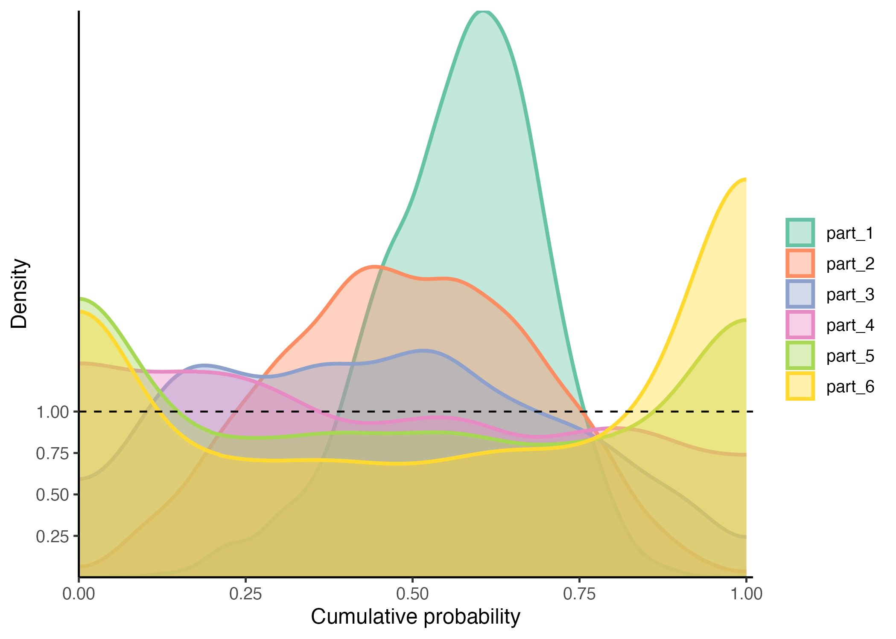
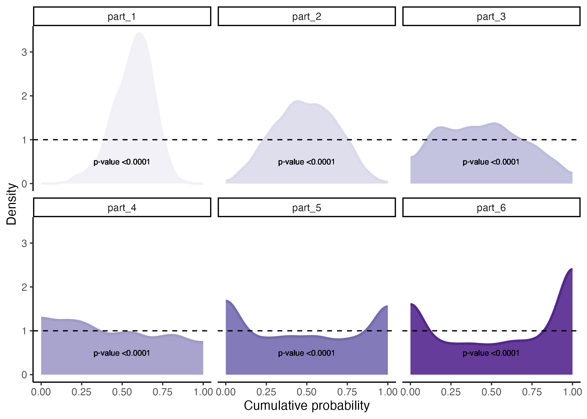
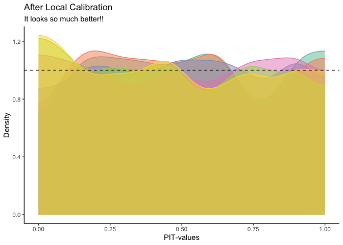

<!-- README.md is generated from README.Rmd. Please edit that file -->

# recalibratiNN

<!-- badges: start -->
<!-- badges: end -->

This package aims to provide a post processing method to recalibrate
fitted Gaussian models.


## Installation

You can install the current version of recalibratiNN from
[GitHub](https://github.com/) with:

``` r
# install.packages("devtools")
devtools::install_github("cmusso86/recalibratiNN")

library(recalibratiNN)
```

Alternately, one can use the `pacman` package to both install and
download.

``` r
if(!require(pacman)) install.packages("pacman")
pacman::p_load_current_gh("cmusso86/recalibratiNN")
```

## Example

### Diagnosing miscalibration

#### Generating data and understanding what miscalibration is

This is a basic example which shows you a common problem of
miscalibration. To do so, we created an heterocedastic model and fitted
with a simple linear regression.

``` r


## basica artificial model example


set.seed(42)
n <- 10000
split <- 0.8

# Auxiliary functions
mu <- function(x1){
10 + 5*x1^2
}

sigma_v <- function(x1){
30*x1
}

# generating heterocedastic data (true model)

x <- runif(n, 1, 10)
y <- rnorm(n,mu(x), sigma_v(x))


# slipting data 
x_train <- x[1:(n*split)]
y_train <- y[1:(n*split)]

x_cal <- x[(n*split+1):n]
y_cal <- y[(n*split+1):n]

# fitting a simple linear model
model <- lm(y_train ~ x_train)
```

The points, the true mean and the regression can be observed in the
graph below. We can see that the linear model (dashed black line)
underestimates the mean for both small values of x or greater values of
x.

``` r
pacman::p_load(tidyverse)
pacman::p_load_gh("AllanCameron/geomtextpath")

# use predict to get the confidence intervals
data_predict <- predict(model, 
                        newdata=data.frame(x_train=x_cal), 
                        interval = "prediction") %>% 
  as_tibble() %>% 
  dplyr::mutate(x_cal=x_cal, 
                y_cal=y_cal,
          IC=ifelse(y_cal<=upr&y_cal>=lwr, "in", "out")) 

data_predict %>% 
  ggplot(aes(x_cal))+
  geom_point(mapping=aes(x_cal, y_cal, color=IC), alpha=0.6)+
  geom_labelline(aes( y=mu(x_cal), label="True Mean" ), 
                 size=1.8, hjust=-0.01, linewidth=0.7, color="red" )+
  geom_smooth(aes( y=y_cal ), color="black",se=F,
                   method="lm", formula=y~x,linetype="dashed" )+
  scale_color_manual("IC 95%", values=c("#00822e", "#2f1d86"))+
  theme_classic()
   
```


## Using the package 

### Checking for global miscalibration

Using the fuction `PIT_values()` function to obtain pit-values for the
fitted model for a calibration set.

``` r
# predictions for the calibraion set
y_hat <- predict(model, 
                 data.frame(x_train=x_cal))

# MSE from calibration set
MSE_cal <- mean((y_hat - y_cal)^2)


library(recalibratiNN)
# from now on we are using the package

# pit-values for calibration set
pit <- PIT_global(ycal=y_cal, 
                  yhat=y_hat, 
                  mse=MSE_cal)

head(pit)
#> [1] 0.04551257 0.42522358 0.81439164 0.69119416 0.44043239 0.99770918
```

Then, one can proceed with visualizing this the histogram and testing if
it fits a uniform distribution.

``` r
gg_PIT_global(pit)
```


In this case, since we are fiting an lm() to an heterocedastic model,
the histogram seems shifted indication a misscalibration. In the image
we also present the p_value from the hispothesis testing of
Kolmogorov-Smirnov test, performed with the `ks.test()` function from
`stats` package.

One can also want to visualize the miscalibration as QQ-plot-like graph,
showing the cumulative predictive distribution in the x-axis versus the
empirical cumulative distribution.

``` r
gg_QQ_global(pit,
             y_cal, 
             y_hat, 
             MSE_cal)
```


#### Checking for local Calibration

``` r
# calculating local PIT 
pit_local <- PIT_local(xcal = x_cal, 
                       ycal=y_cal, 
                       yhat=y_hat, 
                       mse=MSE_cal)

gg_PIT_local(pit_local)
```

We notice the model is uncalibrated in different ways thoughout the
covariates space.


Or you can facet the graph:

``` r
gg_PIT_local(pit_local, facet=T)
```

In the first part, the model is overestimating the variance and
underestimating the mean. In the middle reagion the model is more
calibrated. By the end ir is under estimating the variance. This is a
clear case that would benefit from local calibration, since each
partition behaves differently.



Alternatively you can observe the miscalibration in the QQ-graph.

``` r
gg_QQ_local(pit_local)
gg_QQ_local(pit_local, facet=T)
```


# Recalibration

The recalibration is performed with the `recalibrate()` function. Tho
this date, the function only provides one method (Torres et al. , 2023),
which is inspired in the Aproximate Bayesian Computation. This method
can be either applied globbaly or locally. In this heterocedastic
example you will see the local calibration performs better. The local
calibration uses a KNN algorithm to serach for neighbors from the
calibration set that are the nearest to the new/test set provided.

To perform recalibration you will need to provide the pit-values (always
the global pit-values, regardless of the type of recalibration) and the
Mean Squared Error of the calibration set. The search for new neighbors
can be performed in the covariates level, of any intermediate layer (in
case of a Neural network) or even the output layer. Than the method will
calculate the pit-values and use the Inverse Transform Theorem to
produce recalibrated samples. The size of the vicinity is set to be 10%
of the calibration set, but you can custom it with the p_neighbours
argument.

``` r
# new data 
x_new <- runif(n/5, 1, 10)
y_hat_new <- predict(model,
                     data.frame(
                       x_train=x_new)
                     )

# recalibration
rec <- recalibrate(yhat_new=y_hat_new,
                   space_new = x_new,
                   space_cal= x_cal,
                   pit_values=pit,
                   mse=MSE_cal,
                   type="local",
                   p_neighbours=0.2)
```

Because in this artifitial example we know the true model/process that
generated this data, so we can calucale the empirical pit-values and
verify if the predictions are now better calibrated. Notice that is an
exercice and in real life you probably wont be able to do so, unless you
chose to look ate you test set.

``` r
# what youd be the real observations in this example
y_new_real <- rnorm(n/5, 
                    mu(x_new), 
                    sigma_v(x_new))

# retrieving the weighted samples
y_new_recalib <- rec$y_samples_calibrated_wt

# empiric p-value distribution
pit_new <- purrr::map_dbl(
  1:length(y_new_real), ~{
    mean(y_new_recalib[.,] <=y_new_real[.] )
  })

gg_PIT_global(pit_new)
```



We see now that the pit-values are aproximatedly uniform.
